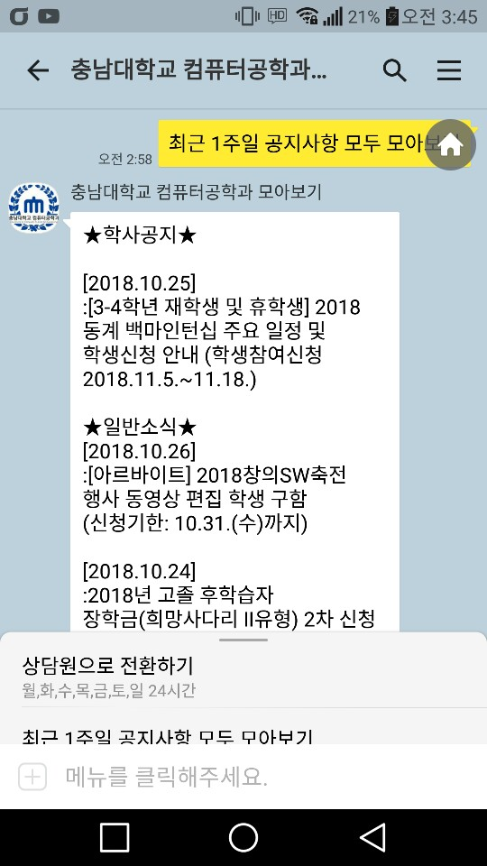

# 스프링 프레임워크 기반의 공지사항 모아보기 카카오봇
* 충남대학교 컴퓨터공학과 사이트의 학사공지, 일반소식, 사업단소식, 취업정보, CSE News 게시판에 업로드 된 최근 1주일 간의 공지사항들을  한번에 모아보기 해주는 봇입니다. 

## 플러스친구 바로가기
[](http://pf.kakao.com/_fWhxbj)

## 개발환경
* Eclipse Java EE IDE for Web Developers.(4.9.0)
* Spring Framework 3.1.1 RELEASE
* Jackson 2.8.11.1
* jdk 8

## HTML parser library
* jsoup 1.10.1

## Server
* raspberry3 tomcat8

## Controller

1. keyboard
```
  @RequestMapping(value = "/keyboard", method = RequestMethod.GET, produces="text/plain;charset=UTF-8")
	@ResponseBody
	public String keyboard() {
		System.out.println("키보드");
		JSONObject jsonObject = new JSONObject();
		ArrayList<String> btn = new ArrayList();
		
		btn.add("최근 1주일 공지사항 모두 모아보기");
				
		jsonObject.put("type", "buttons");
		jsonObject.put("buttons",btn);
		
		return jsonObject.toJSONString();
	} 
  ```

2. message
```
@RequestMapping(value = "/message", method = RequestMethod.POST, headers = "Accept=application/json",produces="application/json;charset=UTF-8")
	@ResponseBody
	public String message(@RequestBody JSONObject responseObject) throws IOException {
		//System.out.println("메시지 전송");
		//System.out.println(responseObject.toJSONString());
		
		String content = (String)responseObject.get("content");
		JSONObject jsonText = new JSONObject();
		JSONObject jsonBtn = new JSONObject();
		JSONObject jsonReturn = new JSONObject();
		
		ArrayList<String> btn = new ArrayList();
		btn.add("최근 1주일 공지사항 모두 모아보기");
		jsonBtn.put("type", "buttons");
		jsonBtn.put("buttons",btn);
		
		Date date = new Date();
		SimpleDateFormat formatter = new SimpleDateFormat("yyyy.MM.dd");
		String today = formatter.format(date);
		
		int cnt=0;
		String response="";
	
		if(content.contains("최근 1주일 공지사항 모두 모아보기")) {
			String notice_page ="notice";
			String gnotice_page ="gnotice";
			String saccord_page ="saccord";
			String job_page ="job";
			String event_page ="event";
						
			ArrayList<Elements> notice_ele = getTitles(notice_page);
			ArrayList<Elements> gnotice_ele = getTitles(gnotice_page);
			ArrayList<Elements> saccord_ele = getTitles(saccord_page);
			ArrayList<Elements> job_ele = getTitles(job_page);
			ArrayList<Elements> event_ele = getTitles(event_page);
			
			Elements notice_titles = notice_ele.get(0);
			Elements notice_time = notice_ele.get(1);
			
			Elements gnotice_titles = gnotice_ele.get(0);
			Elements gnotice_time = gnotice_ele.get(1);
			
			Elements saccord_titles = saccord_ele.get(0);
			Elements saccord_time = saccord_ele.get(1);
			
			Elements job_titles = job_ele.get(0);
			Elements job_time = job_ele.get(1);
			
			Elements event_titles = event_ele.get(0);
			Elements event_time = event_ele.get(1);
			
			
			response="★학사공지★\n";
			for(int i=0; i<notice_titles.size(); i++) {
				if(doDiffOfDate(notice_time.get(i).text(),today,7)) {
					cnt++;
					response+="\n["+notice_time.get(i).text()+"]\n:"+notice_titles.get(i).text()+"\n";
				}
			}
			if(cnt==0) {response+="\n※학사공지가 없습니다.\n";}
			cnt=0;
			
			response +="\n★일반소식★";
			for(int i=0; i<gnotice_titles.size(); i++) {
				if(doDiffOfDate(gnotice_time.get(i).text(),today,7)) {
					cnt++;
					response+="\n["+gnotice_time.get(i).text()+"]\n:"+gnotice_titles.get(i).text()+"\n";
				}
			}
			if(cnt==0) {response+="\n※일반소식이 없습니다.\n";}
			cnt=0;
			
			response +="\n★사업단소식★";
			for(int i=0; i<saccord_titles.size(); i++) {
				if(doDiffOfDate(saccord_time.get(i).text(),today,7)) {
					cnt++;
					response+="\n["+saccord_time.get(i).text()+"]\n:"+saccord_titles.get(i).text()+"\n";
				}
			}
			if(cnt==0) {response+="\n※사업단소식이 없습니다.\n";}
			cnt=0;
			
			response +="\n★취업정보★";
			for(int i=0; i<job_titles.size(); i++) {
				if(doDiffOfDate(job_time.get(i).text(),today,7)) {
					cnt++;
					response+="\n["+job_time.get(i).text()+"]\n:"+job_titles.get(i).text()+"\n";
				}
			}
			if(cnt==0) {response+="\n※취업정보가 없습니다.\n";}
			cnt=0;
			
			response +="\n★CSE News★";
			for(int i=0; i<event_titles.size(); i++) {
				if(doDiffOfDate(event_time.get(i).text(),today,7)) {
					cnt++;
					response+="\n["+event_time.get(i).text()+"]\n:"+event_titles.get(i).text()+"\n";
				}
			}
			if(cnt==0) {response+="\n※CSE News가 없습니다.";}
			cnt=0;
				
		}
		
		jsonText.put("text", response);
		jsonReturn.put("message", jsonText);
		jsonReturn.put("keyboard", jsonBtn);
		
		return jsonReturn.toJSONString();
	}
```
3. crawling
```
public ArrayList getTitles(String page) throws IOException {
		Document doc = Jsoup.connect("http://computer.cnu.ac.kr/index.php?mid="+page).get();
		Element table = doc.select("table[class=bd_lst bd_tb_lst bd_tb] tbody").first();
		Elements titles = table.select( "a" );
		Elements times = doc.select("td[class=time]");
		ArrayList<Elements> ele = new ArrayList<Elements>();
		ele.add(titles);
		ele.add(times);
		return ele;
	}
```
## 실행 결과


